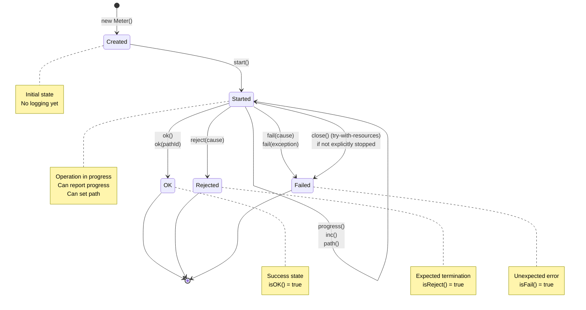

# Meter State Diagram

This document describes the valid lifecycle states and transitions for the `Meter` class.

## States

A `Meter` instance can be in one of the following states:

| State | Description | Condition |
|-------|-------------|-----------|
| **Created** | Meter created but not started | `startTime == 0 && stopTime == 0` |
| **Started** | Meter running (operation in progress) | `startTime != 0 && stopTime == 0` |
| **Stopped** | Meter finished (terminal state) | `stopTime != 0` |

### Terminal Substates

When **Stopped**, the Meter can be in one of three mutually exclusive substates:

| Substate | Description | Condition | Log Level |
|----------|-------------|-----------|-----------|
| **OK** | Operation completed successfully | `stopTime != 0 && failPath == null && rejectPath == null` | INFO (WARN if slow) |
| **Rejected** | Operation terminated due to business rules | `stopTime != 0 && rejectPath != null` | INFO |
| **Failed** | Operation terminated due to technical error | `stopTime != 0 && failPath != null` | ERROR |

## State Transition Diagram



## Valid Transitions

### 1. Normal Success Flow

```java
Meter meter = new Meter(logger, "operation");
meter.start();           // Created → Started
meter.inc();             // increment iteration counter
meter.progress();        // log intermediate progress
meter.ok();              // Started → OK (Stopped)
```

### 2. Success with Path

```java
Meter meter = new Meter(logger, "operation");
meter.start();           // Created → Started
meter.path("mainPath");  // set success path
meter.ok();              // Started → OK with path
// or: meter.ok("altPath");  // override with different path
```

### 3. Rejection Flow

```java
Meter meter = new Meter(logger, "operation");
meter.start();              // Created → Started
meter.reject("validation"); // Started → Rejected (Stopped)
```

### 4. Failure Flow

```java
Meter meter = new Meter(logger, "operation");
meter.start();                                    // Created → Started
meter.fail(new IllegalStateException("error"));   // Started → Failed (Stopped)
```

### 5. Try-With-Resources (Automatic Failure)

```java
try (Meter meter = new Meter(logger, "operation").start()) {
    // if no explicit ok/reject/fail is called before close()...
} // close() → Started → Failed with failPath="try-with-resources"
```

## Invalid/Ignored Transitions

The `Meter` API is **non-intrusive** and will not throw exceptions for invalid state transitions. Instead, it logs warnings and ignores the invalid calls:

| From State | Method Call | Behavior |
|------------|-------------|----------|
| Created | `ok()`, `reject()`, `fail()` | Logs warning, no effect |
| Created | `progress()` | Logs warning, no effect |
| Started | `start()` (again) | Logs warning, ignores second start |
| Stopped (any) | `start()` | Logs warning, ignores restart |
| Stopped (any) | `ok()`, `reject()`, `fail()` | Logs warning, no state change |
| Stopped (any) | `progress()` | Logs warning, no effect |

### Idempotency After Stop

Once a `Meter` reaches a **Stopped** state, it **cannot transition to any other state**. Subsequent calls to termination methods are ignored:

```java
meter.start();
meter.ok();              // Started → OK
meter.fail(exception);   // IGNORED - already stopped
meter.reject("reason");  // IGNORED - already stopped
```

The **first termination call wins**:

```java
meter.start();
meter.reject("validation");  // Started → Rejected (WINS)
meter.ok();                  // IGNORED
```

## State Query Methods

| Method | Returns `true` when |
|--------|---------------------|
| `isStarted()` | `startTime != 0` |
| `isStopped()` | `stopTime != 0` |
| `isOK()` | Stopped successfully (no fail/reject) |
| `isReject()` | Stopped with rejection |
| `isFail()` | Stopped with failure |
| `isSlow()` | Execution time exceeds configured limit |

## Logging Behavior by State

| Transition | Message Logger | Data Logger | Marker |
|------------|----------------|-------------|--------|
| `start()` | DEBUG | TRACE | `MSG_START`, `DATA_START` |
| `ok()` | INFO (or WARN if slow) | TRACE | `MSG_OK`, `DATA_OK` |
| `reject()` | INFO | TRACE | `MSG_REJECT`, `DATA_REJECT` |
| `fail()` | ERROR | TRACE | `MSG_FAIL`, `DATA_FAIL` |
| `progress()` | INFO | TRACE | `MSG_PROGRESS`, `DATA_PROGRESS` |
| Invalid call | WARN | - | `INCONSISTENT_*` |

## Validation and Error Handling

All state validations are handled by [MeterValidator.java](../src/main/java/org/usefultoys/slf4j/meter/MeterValidator.java):

- **`validateStartPrecondition()`**: Ensures meter hasn't already started
- **`validateStopPrecondition()`**: Ensures meter was started and not already stopped
- **`validateProgressPrecondition()`**: Ensures meter has been started
- **`validateFinalize()`**: Detects meters that were started but never stopped (logs error during garbage collection)

## Thread-Local Stack Management

When a `Meter` is started, it becomes the **current instance** for the thread:

```java
Meter.getCurrentInstance()  // returns the most recently started meter
```

Nested meters are supported via a thread-local stack:

```java
Meter outer = new Meter(logger, "outer").start();
// outer is current

Meter inner = new Meter(logger, "inner").start();
// inner is current

inner.ok();
// outer becomes current again

outer.ok();
// no current meter
```

## References

- Implementation: [Meter.java](../src/main/java/org/usefultoys/slf4j/meter/Meter.java)
- State analysis: [MeterAnalysis.java](../src/main/java/org/usefultoys/slf4j/meter/MeterAnalysis.java)
- Validation: [MeterValidator.java](../src/main/java/org/usefultoys/slf4j/meter/MeterValidator.java)
- Data model: [MeterData.java](../src/main/java/org/usefultoys/slf4j/meter/MeterData.java)
- Tests: [MeterStateAttributesTest.java](../src/test/java/org/usefultoys/slf4j/meter/MeterStateAttributesTest.java)
