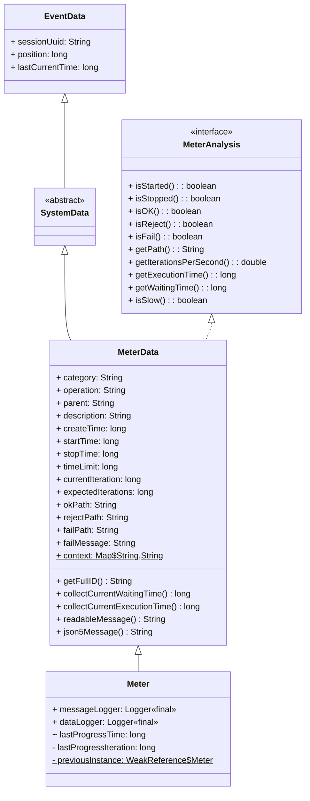
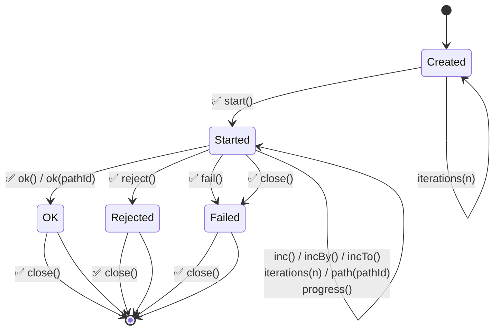

# Meter State Diagram

This document describes the lifecycle states and transitions for the `Meter` class, based on the attributes defined in `MeterData`.

## Class Hierarchy



**Visibility symbols:**  
  - `+` public  
  - `-` private  
  - `#` protected  
  - `~` package-private (default)


## States

A `Meter` instance is always in one of the following states, determined by its `MeterData` attributes:

| State | Description | Condition (MeterData) |
|-------|-------------|-----------------------|
| **Created** | Initial state after instantiation | `startTime == 0 && stopTime == 0` |
| **Started** | Operation in progress | `startTime != 0 && stopTime == 0` |
| **Stopped (OK)** | Successful completion | `stopTime != 0 && failPath == null && rejectPath == null` |
| **Stopped (Rejected)** | Business rule rejection | `stopTime != 0 && rejectPath != null` |
| **Stopped (Failed)** | Technical failure | `stopTime != 0 && failPath != null` |

States are mutually exclusive and collectively exhaustive.
The state is queried from the `MeterAnalysis` mixin interface which implements que state methods based on `MeterData` attributes.

## State Transition Diagram

Only valid transitions are shown.



## Transitions

The following table details all state-related method calls for `Meter`.

**Legend:**
- ✅ **Valid state-changing (expected flow):** A valid call that changes the lifecycle in the normal sequence (typically `Created → Started → (OK | Rejected | Failed)`), by updating state-driving attributes.
- ☑️ **Valid non-state-changing (expected flow):** A valid call used while the meter is in a normal state for that call. It does not change the lifecycle classification, but may update supporting attributes.
- ⚠️ **State-correcting (outside expected flow):** The call violates the expected API contract, but is accepted and applied to correct the state to a valid configuration while maintaining resilience. It may change the lifecycle state and/or update attributes. An error log entry is typically emitted (e.g., `ILLEGAL` or `INCONSISTENT_*`).
- ❌ **State-preserving (invalid flow):** Preconditions and/or arguments are not met, so the call is ignored to preserve the current valid state. No transition/attribute change is applied for that call. An error log entry is typically emitted (e.g., `ILLEGAL` or `INCONSISTENT_*`).

**Definitions:**
- **Lifecycle classification:** The state returned by `isStarted()`, `isStopped()`, `isOK()`, `isReject()`, `isFail()`, and `isSlow()`, based on `MeterData` attributes.
- **State-changing:** Any call that can change the lifecycle classification and/or the reported outcome path (notably `startTime`, `stopTime`, `rejectPath`, `failPath`, `okPath`, and `timeLimit`).
- **Non-state-changing:** Calls that do not change the lifecycle classification, but may still update supporting attributes (e.g., `expectedIterations`, `currentIteration`, progress bookkeeping).
- **Expected flow:** Calls made when the meter is in a state where that call is normally valid and intended to be used.
- **State-correcting:** Calls made when the meter is in a state where that call violates the expected API contract, but the call is applied anyway because it can still result in a valid state transition. The call is accepted through resilience to correct or advance the state to a valid configuration, even though the flow that led to the call was outside the expected sequence.
- **State-preserving:** Calls made when preconditions or arguments are invalid, so the call is rejected and the state remains unchanged to preserve resilience.
- **Invalid flow:** A flow characterized by either invalid method arguments (e.g., null values when not allowed, non-positive numbers when positivity is required) or preconditions that would result in invalid state transitions (e.g., violating the immutable lifecycle guarantee from [TDR-0019](TDR-0019-immutable-lifecycle-transitions.md)). Calls in invalid flows are rejected without state change.
- **Resilience:** The ability of the `Meter` to handle incorrect usage gracefully (non-intrusive behavior), without throwing exceptions or entering an invalid internal state.

Some methods (as description, context) are not included in the table as they do not affect the lifecycle state.

The table below is intentionally exhaustive: for each lifecycle state (`Created`, `Started`, `OK`, `Rejected`, `Failed`), it lists the behavior of every relevant call (including calls that are invalid or discouraged).

Note: A call may be valid for a given state, but still be invalid if its arguments are invalid. For example, `Created → iterations(n) → Created` is valid when `n > 0`, but becomes an ❌ ignored call (with an error log entry) when `n <= 0`.

|  | From State | Call | To State | Notes |
|:--:|:---|:---|:---|:---|
| ☑️ | **Created** | `iterations(n)` | **Created** | When `n > 0`: sets `expectedIterations`.<br/>Otherwise: logs `ILLEGAL` (Non-positive argument).
| ☑️ | **Created** | `limitMilliseconds(n)` | **Created** | When `n > 0`: sets `timeLimit`.<br/>Otherwise: logs `ILLEGAL` (Non-positive argument).
| ❌ | **Created** | `path(okPath)` | **Created** | Ignored. Logs `ILLEGAL` (Meter path but not started).
| ❌ | **Created** | `inc()` | **Created** | Ignored. Logs `INCONSISTENT_INCREMENT` (Meter not started).
| ❌ | **Created** | `incBy(n)` | **Created** | Ignored. Logs `INCONSISTENT_INCREMENT` (Meter not started).
| ❌ | **Created** | `incTo(n)` | **Created** | Ignored. Logs `INCONSISTENT_INCREMENT` (Meter not started).
| ✅ | **Created** | `start()` | **Started** | Normal start. Sets `startTime` and enables thread-local propagation.
| ❌ | **Created** | `progress()` | **Created** | Ignored. Logs `INCONSISTENT_PROGRESS` (Meter progress but not started).
| ⚠️ | **Created** | `ok()` | **OK** | Termination (resilience). Logs `INCONSISTENT_OK` (Meter stopped but not started).
| ⚠️ | **Created** | `ok(okPath)` | **OK** | Termination (resilience). When `okPath == null`: logs `ILLEGAL` (Null argument).<br/>Otherwise: logs `INCONSISTENT_OK` (Meter stopped but not started).
| ⚠️ | **Created** | `reject(cause)` | **Rejected** | Termination (resilience). When `cause == null`: logs `ILLEGAL` (Null argument).<br/>Otherwise: logs `INCONSISTENT_REJECT` (Meter stopped but not started).
| ⚠️ | **Created** | `fail(cause)` | **Failed** | Termination (resilience). When `cause == null`: logs `ILLEGAL` (Null argument).<br/>Otherwise: logs `INCONSISTENT_FAIL` (Meter stopped but not started).
| ⚠️ | **Created** | `close()` | **Failed** | Termination (resilience). Logs `INCONSISTENT_CLOSE` (Meter stopped but not started).
| ❌ | **Created** | `finalize()` | **Created** | Ignored. `validateFinalize` logs only when Started and not Stopped.
| ⚠️ | **Started** | `start()` | **Started** | State-correcting. Logs `INCONSISTENT_START` (Meter already started). Resets `startTime` to now.
| ☑️ | **Started** | `iterations(n)` | **Started** | When `n > 0`: sets/overrides `expectedIterations`.<br/>Otherwise: logs `ILLEGAL` (Non-positive argument).
| ☑️ | **Started** | `limitMilliseconds(n)` | **Started** | When `n > 0`: sets/overrides `timeLimit`.<br/>Otherwise: logs `ILLEGAL` (Non-positive argument).
| ☑️ | **Started** | `path(okPath)` | **Started** | When `okPath == null`: logs `ILLEGAL` (Null argument).<br/>Otherwise: sets/overrides `okPath`.
| ☑️ | **Started** | `inc()` | **Started** | Increments `currentIteration`.
| ☑️ | **Started** | `incBy(n)` | **Started** | When `n > 0`: adds `n` to `currentIteration`.<br/>Otherwise: logs `ILLEGAL` (Non-positive increment).
| ☑️ | **Started** | `incTo(n)` | **Started** | When `n > 0` and `n > currentIteration`: sets `currentIteration = n`.<br/>Otherwise when `n <= 0`: logs `ILLEGAL` (Non-positive argument).<br/>Otherwise: logs `ILLEGAL` (Non-forward increment).
| ☑️ | **Started** | `progress()` | **Started** | May log progress periodically (only when progress advanced and throttling allows).
| ✅ | **Started** | `ok()` | **OK** | Normal termination.
| ✅ | **Started** | `ok(okPath)` | **OK** | When okPath == null: logs `ILLEGAL` (Null argument).<br/>Otherwise: normal termination with path.
| ✅ | **Started** | `reject(cause)` | **Rejected** | When cause == null: logs `ILLEGAL` (Null argument).<br/>Otherwise: normal rejection termination.
| ✅ | **Started** | `fail(cause)` | **Failed** | When cause == null: logs `ILLEGAL` (Null argument).<br/>Otherwise: normal failure termination.
| ✅ | **Started** | `close()` | **Failed** | Auto-fail for try-with-resources when not explicitly stopped.
| ⚠️ | **Started** | `finalize()` | **Started** | Termination (resilience). Logs `INCONSISTENT_FINALIZED` (Meter started but never stopped).
| ❌ | **OK** | `start()` | **OK** | Ignored. Logs `INCONSISTENT_START` (Meter already started). Violates immutability guarantee. ⚠️ **Implementation diverges**: currently resets `startTime`.
| ❌ | **OK** | `iterations(n)` | **OK** | Ignored. Logs `ILLEGAL` (Meter iterations but already stopped).
| ❌ | **OK** | `limitMilliseconds(n)` | **OK** | Ignored. Logs `ILLEGAL` (Meter already stopped).
| ❌ | **OK** | `path(okPath)` | **OK** | Ignored. Logs `ILLEGAL` (Meter already stopped).
| ❌ | **OK** | `inc()` | **OK** | Ignored. Logs `INCONSISTENT_INCREMENT` (Meter already stopped).
| ❌ | **OK** | `incBy(n)` | **OK** | Ignored. Logs `INCONSISTENT_INCREMENT` (Meter already stopped).
| ❌ | **OK** | `incTo(n)` | **OK** | Ignored. Logs `INCONSISTENT_INCREMENT` (Meter already stopped).
| ❌ | **OK** | `progress()` | **OK** | Ignored. Logs `INCONSISTENT_PROGRESS` (Meter already stopped).
| ❌ | **OK** | `ok()` | **OK** | Ignored. Logs `INCONSISTENT_OK` (Meter already stopped). Violates immutability guarantee.
| ❌ | **OK** | `ok(okPath)` | **OK** | Ignored. When `okPath == null`: logs `ILLEGAL` (Null argument).<br/>Otherwise: logs `INCONSISTENT_OK` (Meter already stopped). Violates immutability guarantee.
| ❌ | **OK** | `reject(cause)` | **OK** | Ignored. When `cause == null`: logs `ILLEGAL` (Null argument).<br/>Otherwise: logs `INCONSISTENT_REJECT` (Meter already stopped). Violates immutability guarantee. ⚠️ **Implementation diverges**: currently transitions to Rejected state.
| ❌ | **OK** | `fail(cause)` | **OK** | Ignored. When `cause == null`: logs `ILLEGAL` (Null argument).<br/>Otherwise: logs `INCONSISTENT_FAIL` (Meter already stopped). Violates immutability guarantee. ⚠️ **Implementation diverges**: currently transitions to Failed state.
| ❌ | **OK** | `close()` | **OK** | Ignored. `close()` returns immediately when already stopped.
| ❌ | **OK** | `finalize()` | **OK** | Ignored. `validateFinalize` logs only when Started and not Stopped.
| ❌ | **Rejected** | `start()` | **Rejected** | Ignored. Logs `INCONSISTENT_START` (Meter already started). Violates immutability guarantee. ⚠️ **Implementation diverges**: currently resets `startTime`.
| ❌ | **Rejected** | `iterations(n)` | **Rejected** | Ignored. Logs `ILLEGAL` (Meter already stopped).
| ❌ | **Rejected** | `limitMilliseconds(n)` | **Rejected** | Ignored. Logs `ILLEGAL` (Meter already stopped).
| ❌ | **Rejected** | `path(okPath)` | **Rejected** | Ignored. Logs `ILLEGAL` (Meter already stopped).
| ❌ | **Rejected** | `inc()` | **Rejected** | Ignored. Logs `INCONSISTENT_INCREMENT` (Meter already stopped).
| ❌ | **Rejected** | `incBy(n)` | **Rejected** | Ignored. Logs `INCONSISTENT_INCREMENT` (Meter already stopped).
| ❌ | **Rejected** | `incTo(n)` | **Rejected** | Ignored. Logs `INCONSISTENT_INCREMENT` (Meter already stopped).
| ❌ | **Rejected** | `progress()` | **Rejected** | Ignored. Logs `INCONSISTENT_PROGRESS` (Meter already stopped).
| ❌ | **Rejected** | `ok()` | **OK** | Ignored. Logs `INCONSISTENT_OK` (Meter already stopped). Violates immutability guarantee. ⚠️ **Implementation diverges**: currently transitions to OK state.
| ❌ | **Rejected** | `ok(okPath)` | **OK** | Ignored. When `okPath == null`: logs `ILLEGAL` (Null argument).<br/>Otherwise: logs `INCONSISTENT_OK` (Meter already stopped). Violates immutability guarantee. ⚠️ **Implementation diverges**: currently transitions to OK state.
| ❌ | **Rejected** | `reject(cause)` | **Rejected** | Ignored. When `cause == null`: logs `ILLEGAL` (Null argument).<br/>Otherwise: logs `INCONSISTENT_REJECT` (Meter already stopped). Violates immutability guarantee.
| ❌ | **Rejected** | `fail(cause)` | **Failed** | Ignored. When `cause == null`: logs `ILLEGAL` (Null argument).<br/>Otherwise: logs `INCONSISTENT_FAIL` (Meter already stopped). Violates immutability guarantee. ⚠️ **Implementation diverges**: currently transitions to Failed state.
| ❌ | **Rejected** | `close()` | **Rejected** | Ignored. `close()` returns immediately when already stopped.
| ❌ | **Rejected** | `finalize()` | **Rejected** | Ignored. `validateFinalize` logs only when Started and not Stopped.
| ❌ | **Failed** | `start()` | **Failed** | Ignored. Logs `INCONSISTENT_START` (Meter already started). Violates immutability guarantee. ⚠️ **Implementation diverges**: currently resets `startTime`.
| ❌ | **Failed** | `iterations(n)` | **Failed** | Ignored. Logs `ILLEGAL` (Meter already stopped).
| ❌ | **Failed** | `limitMilliseconds(n)` | **Failed** | Ignored. Logs `ILLEGAL` (Meter already stopped).
| ❌ | **Failed** | `path(okPath)` | **Failed** | Ignored. Logs `ILLEGAL` (Meter already stopped).
| ❌ | **Failed** | `inc()` | **Failed** | Ignored. Logs `INCONSISTENT_INCREMENT` (Meter already stopped).
| ❌ | **Failed** | `incBy(n)` | **Failed** | Ignored. Logs `INCONSISTENT_INCREMENT` (Meter already stopped).
| ❌ | **Failed** | `incTo(n)` | **Failed** | Ignored. Logs `INCONSISTENT_INCREMENT` (Meter already stopped).
| ❌ | **Failed** | `progress()` | **Failed** | Ignored. Logs `INCONSISTENT_PROGRESS` (Meter already stopped).
| ❌ | **Failed** | `ok()` | **Failed** | Ignored. Logs `INCONSISTENT_OK` (Meter already stopped). Violates immutability guarantee. ⚠️ **Implementation diverges**: currently transitions to OK state.
| ❌ | **Failed** | `ok(okPath)` | **Failed** | Ignored. When `okPath == null`: logs `ILLEGAL` (Null argument).<br/>Otherwise: logs `INCONSISTENT_OK` (Meter already stopped). Violates immutability guarantee. ⚠️ **Implementation diverges**: currently transitions to OK state.
| ❌ | **Failed** | `reject(cause)` | **Failed** | Ignored. When `cause == null`: logs `ILLEGAL` (Null argument).<br/>Otherwise: logs `INCONSISTENT_REJECT` (Meter already stopped). Violates immutability guarantee. ⚠️ **Implementation diverges**: currently transitions to Rejected state.
| ❌ | **Failed** | `fail(cause)` | **Failed** | Ignored. When `cause == null`: logs `ILLEGAL` (Null argument).<br/>Otherwise: logs `INCONSISTENT_FAIL` (Meter already stopped). Violates immutability guarantee.
| ❌ | **Failed** | `close()` | **Failed** | Ignored. `close()` returns immediately when already stopped.
| ❌ | **Failed** | `finalize()` | **Failed** | Ignored. `validateFinalize` logs only when Started and not Stopped.

## State Query Methods

| Method | Returns `true` when | Condition (MeterData) |
|--------|---------------------|-----------------------|
| `isStarted()` | Operation has started | `startTime != 0` |
| `isStopped()` | Operation has finished | `stopTime != 0` |
| `isOK()` | Stopped successfully | `stopTime != 0 && failPath == null && rejectPath == null` |
| `isReject()` | Stopped with rejection | `stopTime != 0 && rejectPath != null` |
| `isFail()` | Stopped with failure | `stopTime != 0 && failPath != null` |
| `isSlow()` | Execution time exceeds limit | `timeLimit != 0 && startTime != 0 && (executionTime > timeLimit)` |

> **Note**: `executionTime` is `stopTime - startTime` if stopped, or `now - startTime` if still running.

## Validation and Error Handling

All state validations are handled by [MeterValidator.java](../src/main/java/org/usefultoys/slf4j/meter/MeterValidator.java):

- **`validateStartPrecondition()`**: Ensures meter hasn't already started (checks `startTime == 0`).
- **`validateStopPrecondition()`**: Ensures meter was started and not already stopped (checks `stopTime == 0`).
- **`validateProgressPrecondition()`**: Ensures meter has been started (checks `startTime != 0`).
- **`validateIterationsPrecondition()`**: Ensures iterations count is set before meter is stopped (checks `stopTime == 0`).
- **`validateIncPrecondition()`**: Ensures meter has been started before incrementing (checks `startTime != 0`).
- **`validatePathPrecondition()`**: Ensures meter has been started before setting path (checks `startTime != 0`).
- **`validatePathArgument()`**: Logs an error if path identifiers are null (non-blocking).
- **`validateIncBy()` / `validateIncToArguments()`**: Validates increment values and forward progress.
- **`validateFinalize()`**: Detects meters that were started but never stopped (logs error during garbage collection).

## Thread-Local Stack Management

When a `Meter` is started, it becomes the **current instance** for the thread. Nested meters are supported via a thread-local stack. When a meter stops, the previous meter in the stack becomes current again.

```java
Meter.getCurrentInstance()  // returns the most recently started meter
```

## References

- Implementation: [Meter.java](../src/main/java/org/usefultoys/slf4j/meter/Meter.java)
- State analysis: [MeterAnalysis.java](../src/main/java/org/usefultoys/slf4j/meter/MeterAnalysis.java)
- Validation: [MeterValidator.java](../src/main/java/org/usefultoys/slf4j/meter/MeterValidator.java)
- Data model: [MeterData.java](../src/main/java/org/usefultoys/slf4j/meter/MeterData.java)
- Tests: [MeterStateAttributesTest.java](../src/test/java/org/usefultoys/slf4j/meter/MeterStateAttributesTest.java)
