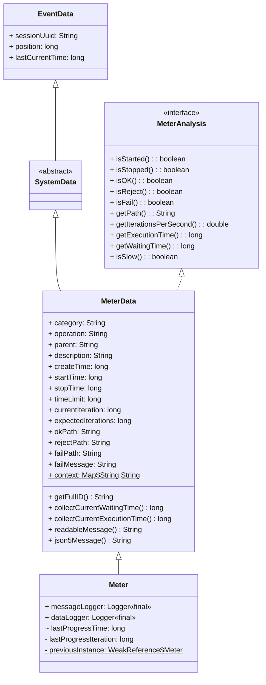
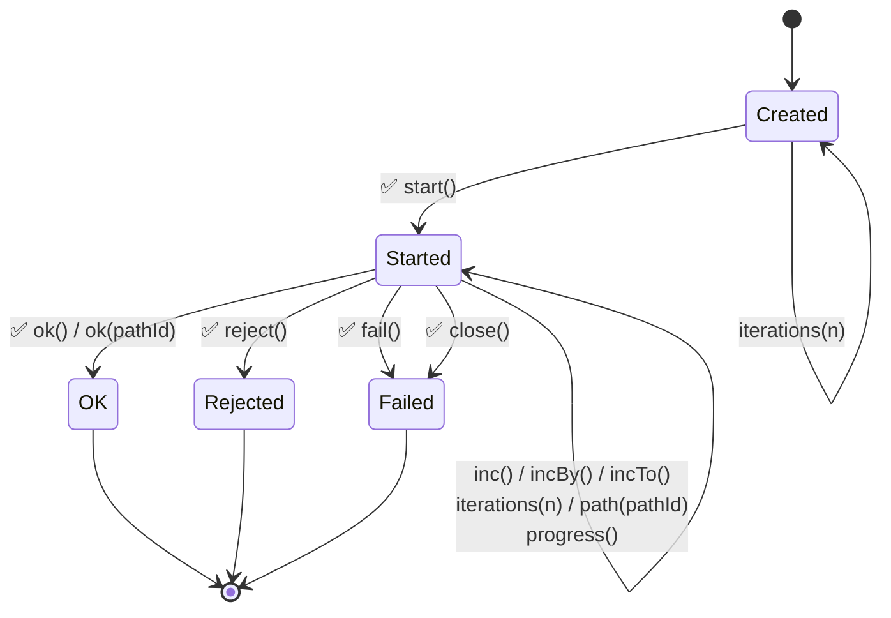

# Meter State Diagram

This document describes the lifecycle states and transitions for the `Meter` class, based on the attributes defined in `MeterData`.

## Class Hierarchy



**Visibility symbols:**  
  - `+` public  
  - `-` private  
  - `#` protected  
  - `~` package-private (default)


## States

A `Meter` instance is always in one of the following states, determined by its `MeterData` attributes:

| State | Description | Condition (MeterData) |
|-------|-------------|-----------------------|
| **Created** | Initial state after instantiation | `startTime == 0 && stopTime == 0` |
| **Started** | Operation in progress | `startTime != 0 && stopTime == 0` |
| **Stopped (OK)** | Successful completion | `stopTime != 0 && failPath == null && rejectPath == null` |
| **Stopped (Rejected)** | Business rule rejection | `stopTime != 0 && rejectPath != null` |
| **Stopped (Failed)** | Technical failure | `stopTime != 0 && failPath != null` |

States are mutually exclusive and collectively exhaustive.
The state is queried from the `MeterAnalysis` mixin interface which implements que state methods based on `MeterData` attributes.

## State Transition Diagram

Only valid transitions are shown.



## Transitions

The following table details all possible transitions, including how the API handles invalid calls (non-intrusive behavior).

**Legend:**
- ✅ **OK**: Condition met in the expected state-changing flow (e.g., `Started -> ok() -> Stopped`).
- ☑️ **OK**: Condition met in the expected non-state-changing calls (e.g., setting iterations or path).
- ⚠️ **Applied**: Condition met, but not in the normal expected flow (e.g., `Created -> ok() -> Stopped`).
- ❌ **Ignored**: Condition not met, transition not performed.

| From State | Method Call | Condition (to realize transition) | To State | Attributes Changed | Logged (Message/Data) | Behavior |
|:---|:---|:---|:---|:---|:---|:---|
| **Created** | `start()` | ✅ `startTime == 0` (`validateStartPrecondition`) | **Started** | `startTime = collectCurrentTime()` | DEBUG (`MSG_START`) / TRACE (`DATA_START`) | Normal start. |
| **Created** | `ok()` | ⚠️ `stopTime == 0` (`validateStopPrecondition`) | **Stopped (OK)** | `stopTime = collectCurrentTime()` | ERROR (`INCONSISTENT_OK`) + INFO (`MSG_OK`) / TRACE (`DATA_OK`) | **Inconsistent**: transitions to Stopped but logs error. |
| **Created** | `ok(pathId)` | ⚠️ `stopTime == 0` (`validateStopPrecondition`) | **Stopped (OK)** | `stopTime = collectCurrentTime()`, `okPath = pathId` | ERROR (`INCONSISTENT_OK`) + INFO (`MSG_OK`) / TRACE (`DATA_OK`) | **Inconsistent**: transitions to Stopped but logs error. |
| **Created** | `reject(cause)` | ⚠️ `stopTime == 0` (`validateStopPrecondition`) | **Stopped (Rejected)** | `stopTime = collectCurrentTime()`, `rejectPath = cause` | ERROR (`INCONSISTENT_REJECT`) + INFO (`MSG_REJECT`) / TRACE (`DATA_REJECT`) | **Inconsistent**: transitions to Stopped but logs error. |
| **Created** | `fail(cause)` | ⚠️ `stopTime == 0` (`validateStopPrecondition`) | **Stopped (Failed)** | `stopTime = collectCurrentTime()`, `failPath = cause` | ERROR (`INCONSISTENT_FAIL`) + ERROR (`MSG_FAIL`) / TRACE (`DATA_FAIL`) | **Inconsistent**: transitions to Stopped but logs error. |
| **Created** | `iterations(n)` | ✅ `n > 0` (`validateIterationsCallArguments`) | **Created** | `expectedIterations = n` | - | Configures expected iterations. |
| **Created** | `path(pathId)` | ❌ `startTime != 0` (`validatePathPrecondition`) | **Created** | - | ERROR (`ILLEGAL`) | **Ignored**: condition not met. |
| **Created** | `inc()`, `incBy(n)`, `incTo(n)` | ❌ `startTime != 0` (`validateIncPrecondition`) | **Created** | - | ERROR (`INCONSISTENT_INCREMENT`) | **Ignored**: condition not met. |
| **Created** | `progress()` | ❌ `startTime != 0` (`validateProgressPrecondition`) | **Created** | - | ERROR (`INCONSISTENT_PROGRESS`) | **Ignored**: condition not met. |
| **Created** | `close()` | ⚠️ `stopTime == 0` (`validateStopPrecondition`) | **Stopped (Failed)** | `stopTime = collectCurrentTime()`, `failPath="try-with-resources"` | ERROR (`INCONSISTENT_CLOSE`) + ERROR (`MSG_FAIL`) / TRACE (`DATA_FAIL`) | **Inconsistent**: transitions to Stopped but logs error. |
| **Started** | `inc()` | ✅ `startTime != 0` (`validateIncPrecondition`) | **Started** | `currentIteration++` | - | Increments iteration count. |
| **Started** | `incBy(n)` | ✅ `n > 0` (`validateIncBy`) AND `startTime != 0` (`validateIncPrecondition`) | **Started** | `currentIteration += n` | - | Increments iteration count by `n`. |
| **Started** | `incTo(n)` | ✅ `n > 0` AND `n > currentIteration` (`validateIncToArguments`) AND `startTime != 0` (`validateIncPrecondition`) | **Started** | `currentIteration = n` | - | Sets iteration count to `n`. |
| **Started** | `iterations(n)` | ✅ `n > 0` (`validateIterationsCallArguments`) | **Started** | `expectedIterations = n` | - | Overrides expected iterations. |
| **Started** | `path(pathId)` | ✅ `startTime != 0` (`validatePathPrecondition`) | **Started** | `okPath = pathId` | - | Sets or overrides the success path. |
| **Started** | `progress()` | ✅ `startTime != 0` (`validateProgressPrecondition`) | **Started** | `lastProgressTime = collectCurrentTime()`, `lastProgressIteration = currentIteration` | INFO (`MSG_PROGRESS`) / TRACE (`DATA_PROGRESS`) | Normal progress report. |
| **Started** | `ok()` | ✅ `stopTime == 0` (`validateStopPrecondition`) | **Stopped (OK)** | `stopTime = collectCurrentTime()` | INFO (`MSG_OK`) or WARN (`MSG_SLOW_OK`) / TRACE (`DATA_OK`) | Normal success termination. |
| **Started** | `ok(pathId)` | ✅ `stopTime == 0` (`validateStopPrecondition`) | **Stopped (OK)** | `stopTime = collectCurrentTime()`, `okPath = pathId` | INFO (`MSG_OK`) or WARN (`MSG_SLOW_OK`) / TRACE (`DATA_OK`) | Normal success termination with path. |
| **Started** | `reject(cause)` | ✅ `stopTime == 0` (`validateStopPrecondition`) | **Stopped (Rejected)** | `stopTime = collectCurrentTime()`, `rejectPath = cause` | INFO (`MSG_REJECT`) / TRACE (`DATA_REJECT`) | Normal rejection termination. |
| **Started** | `fail(cause)` | ✅ `stopTime == 0` (`validateStopPrecondition`) | **Stopped (Failed)** | `stopTime = collectCurrentTime()`, `failPath = cause` | ERROR (`MSG_FAIL`) / TRACE (`DATA_FAIL`) | Normal failure termination. |
| **Started** | `close()` | ✅ `stopTime == 0` (`validateStopPrecondition`) | **Stopped (Failed)** | `stopTime = collectCurrentTime()`, `failPath="try-with-resources"` | ERROR (`MSG_FAIL`) / TRACE (`DATA_FAIL`) | **Auto-fail**: triggered by try-with-resources if not stopped. |
| **Started** | `finalize()` | ⚠️ `startTime != 0 && stopTime == 0` (`validateFinalize`) | **[*]** | - | ERROR (`INCONSISTENT_FINALIZED`) | **GC Collection**: logs error if started but never stopped. |
| **Started** | `start()` | ❌ `startTime == 0` (`validateStartPrecondition`) | **Started** | - | ERROR (`INCONSISTENT_START`) | **Ignored**: condition not met. |
| **Stopped** | `path(pathId)` | ❌ `stopTime == 0` (`validatePathPrecondition`) | **Stopped** | - | ERROR (`ILLEGAL`) | **Ignored**: condition not met. |
| **Stopped** | `iterations(n)` | ⚠️ `n > 0` (`validateIterationsCallArguments`) | **Stopped** | `expectedIterations = n` | - | **Discouraged**: changes iterations even if already stopped. |
| **Stopped** | `inc()`, `incBy()`, `incTo()` | ⚠️ `startTime != 0` (`validateIncPrecondition`) | **Stopped** | `currentIteration` | - | **Allowed**: increments even if stopped (current behavior). |
| **Stopped** | `inc()`, `incBy()`, `incTo()` | ❌ `startTime == 0` (`validateIncPrecondition`) | **Stopped** | - | ERROR (`INCONSISTENT_INCREMENT`) | **Ignored**: cannot increment if never started. |
| **Stopped** | `progress()` | ⚠️ `startTime != 0` (`validateProgressPrecondition`) | **Stopped** | `lastProgressTime = collectCurrentTime()`, `lastProgressIteration = currentIteration` | INFO (`MSG_PROGRESS`) / TRACE (`DATA_PROGRESS`) | **Allowed**: reports progress even if stopped. |
| **Stopped** | `progress()` | ❌ `startTime == 0` (`validateProgressPrecondition`) | **Stopped** | - | ERROR (`INCONSISTENT_PROGRESS`) | **Ignored**: cannot report progress if never started. |
| **Stopped** | `start()` | ❌ `startTime == 0` (`validateStartPrecondition`) | **Stopped** | - | ERROR (`INCONSISTENT_START`) | **Ignored**: condition not met. |
| **Stopped** | `ok()`, `ok(pathId)` | ❌ `stopTime == 0` (`validateStopPrecondition`) | **Stopped** | - | ERROR (`INCONSISTENT_OK`) | **Ignored**: condition not met. |
| **Stopped** | `reject(cause)` | ❌ `stopTime == 0` (`validateStopPrecondition`) | **Stopped** | - | ERROR (`INCONSISTENT_REJECT`) | **Ignored**: condition not met. |
| **Stopped** | `fail(cause)` | ❌ `stopTime == 0` (`validateStopPrecondition`) | **Stopped** | - | ERROR (`INCONSISTENT_FAIL`) | **Ignored**: condition not met. |
| **Stopped** | `close()` | ❌ `stopTime == 0` | **Stopped** | - | - | **Ignored**: condition not met. |

## State Query Methods

| Method | Returns `true` when | Condition (MeterData) |
|--------|---------------------|-----------------------|
| `isStarted()` | Operation has started | `startTime != 0` |
| `isStopped()` | Operation has finished | `stopTime != 0` |
| `isOK()` | Stopped successfully | `stopTime != 0 && failPath == null && rejectPath == null` |
| `isReject()` | Stopped with rejection | `stopTime != 0 && rejectPath != null` |
| `isFail()` | Stopped with failure | `stopTime != 0 && failPath != null` |
| `isSlow()` | Execution time exceeds limit | `timeLimit != 0 && startTime != 0 && (executionTime > timeLimit)` |

> **Note**: `executionTime` is `stopTime - startTime` if stopped, or `now - startTime` if still running.

## Validation and Error Handling

All state validations are handled by [MeterValidator.java](../src/main/java/org/usefultoys/slf4j/meter/MeterValidator.java):

- **`validateStartPrecondition()`**: Ensures meter hasn't already started (checks `startTime == 0`).
- **`validateStopPrecondition()`**: Ensures meter was started and not already stopped (checks `stopTime == 0`).
- **`validateProgressPrecondition()`**: Ensures meter has been started (checks `startTime != 0`).
- **`validateIncPrecondition()`**: Ensures meter has been started before incrementing (checks `startTime != 0`).
- **`validatePathPrecondition()`**: Ensures meter has been started before setting path (checks `startTime != 0`).
- **`validatePathArgument()`**: Logs an error if path identifiers are null (non-blocking).
- **`validateIncBy()` / `validateIncToArguments()`**: Validates increment values and forward progress.
- **`validateFinalize()`**: Detects meters that were started but never stopped (logs error during garbage collection).

## Thread-Local Stack Management

When a `Meter` is started, it becomes the **current instance** for the thread. Nested meters are supported via a thread-local stack. When a meter stops, the previous meter in the stack becomes current again.

```java
Meter.getCurrentInstance()  // returns the most recently started meter
```

## References

- Implementation: [Meter.java](../src/main/java/org/usefultoys/slf4j/meter/Meter.java)
- State analysis: [MeterAnalysis.java](../src/main/java/org/usefultoys/slf4j/meter/MeterAnalysis.java)
- Validation: [MeterValidator.java](../src/main/java/org/usefultoys/slf4j/meter/MeterValidator.java)
- Data model: [MeterData.java](../src/main/java/org/usefultoys/slf4j/meter/MeterData.java)
- Tests: [MeterStateAttributesTest.java](../src/test/java/org/usefultoys/slf4j/meter/MeterStateAttributesTest.java)
