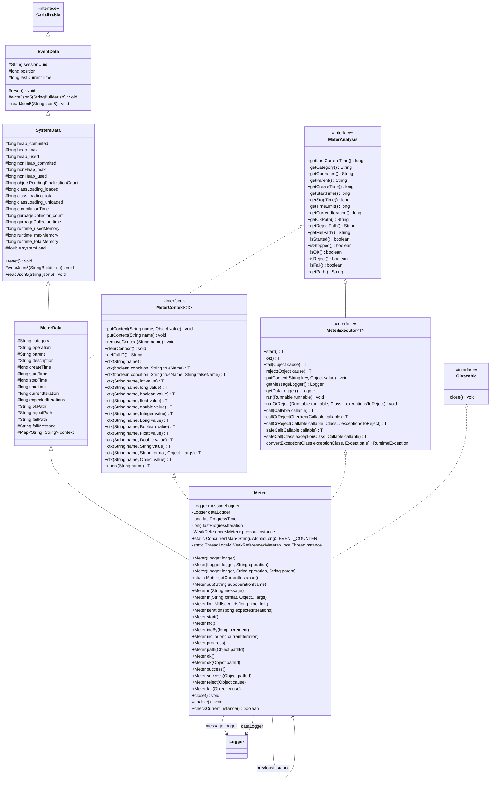

# Diagrama de Classes - Meter

Este diagrama apresenta a estrutura da classe `Meter` e suas principais relações no projeto `slf4j-toys`.

## Descrição das Relações

*   **Meter**: A classe principal que gerencia o ciclo de vida de uma operação.
*   **MeterData**: Contém os dados coletados pela operação (timestamps, iterações, caminhos de sucesso/falha).
*   **SystemData**: Extensão de `EventData` que inclui métricas de status do sistema (JVM e SO).
*   **EventData**: Classe base para todos os eventos, fornecendo identificação (UUID da sessão) e timestamping.
*   **Serializable**: Interface que permite a serialização dos dados.
*   **MeterContext**: Interface para manipulação de contexto (pares chave-valor).

## Legenda de Visibilidade

Os símbolos à esquerda de atributos e métodos indicam seu nível de acesso:
*   `+` : **Public** (Acessível de qualquer lugar)
*   `-` : **Private** (Acessível apenas na própria classe)
*   `#` : **Protected** (Acessível na classe, subclasses e pacote)
*   `~` : **Package-Private** (Acessível apenas dentro do mesmo pacote)
*   **MeterExecutor**: Interface para execução de tarefas funcionais com controle de ciclo de vida.
*   **MeterAnalysis**: Interface base para análise de dados do Meter.
*   **Logger**: Utilizado para registrar mensagens legíveis por humanos e dados para processamento automático.
